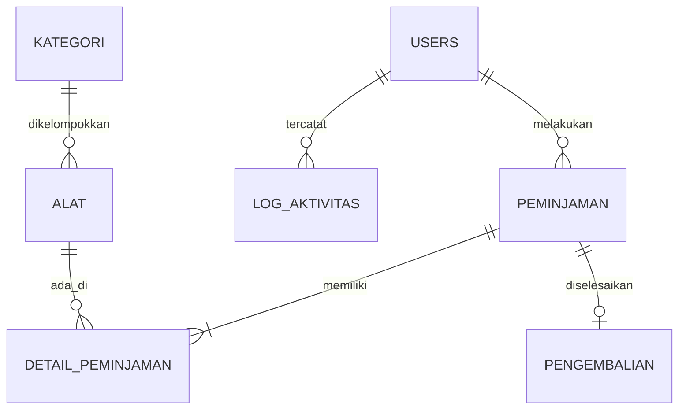

# Dokumentasi Aplikasi Peminjaman Alat UKK RPL

## 1. ERD (Entity Relationship Diagram)

## 2. Flowchart
### Login
- **Mulai** -> Header Login -> Input Username & Password -> Cek DB (MD5) -> **Sukses?** 
  - Ya: Set Session -> Alihkan ke Dashboard
  - Tidak: Set Flash Message -> Kembali ke Login

### Peminjaman
- **Peminjam** -> Pilih Alat -> Tentukan Tanggal -> Submit -> **Status: Menunggu**
- **Admin/Petugas** -> Cek Pengajuan -> **Setujui?** -> Status: Disetujui
- **Serah Terima** -> Status: Dipinjam -> **Stok Alat Berkurang (Trigger)**

### Pengembalian & Denda
- **Pengembalian** -> Input ID Pinjam -> Input Tgl Kembali -> **Hitung Denda (Function)** -> Simpan Pengembalian -> Update Status -> **Stok Alat Bertambah (Trigger)**

## 3. Dokumentasi Fungsi
### Database Wrapper (`Database.php`)
- **Input**: Query String, Bind Parameters.
- **Proses**: PDO Prepared Statement.
- **Output**: Result Set (Array/Single Object).

### Fine Calculation (`fn_hitung_denda`)
- **Input**: `tanggal_kembali_seharusnya`, `tanggal_dikembalikan`.
- **Proses**: Selisih hari * Rp 5.000 (jika terlambat).
- **Output**: Nilai decimal denda.

## 4. Test Case
| No | Skenario | Langkah | Hasil Diharapkan |
|----|----------|---------|------------------|
| 1  | Login Admin | Input user: admin, pass: admin123 | Berhasil masuk ke Dashboard Admin |
| 2  | Tambah Alat | Isi form alat & stok -> Simpan | Data muncul di tabel & stok tercatat |
| 3  | Pinjam Alat | Pilih alat -> Ajukan | Status menjadi 'menunggu' |
| 4  | Persetujuan | Admin tekan 'Setujui' | Status berubah & stok berkurang otomatis |
| 5  | Pengembalian | Tekan 'Kembalikan' saat telat | Denda terhitung otomatis & stok kembali |

## 5. Struktur Proyek
- `app/`: Logika utama (MVC).
- `public/`: Folder yang diakses publik (Assets, index.php).
- `config/`: Konfigurasi DB.
- `core/`: Inti framework MVC sederhana.
